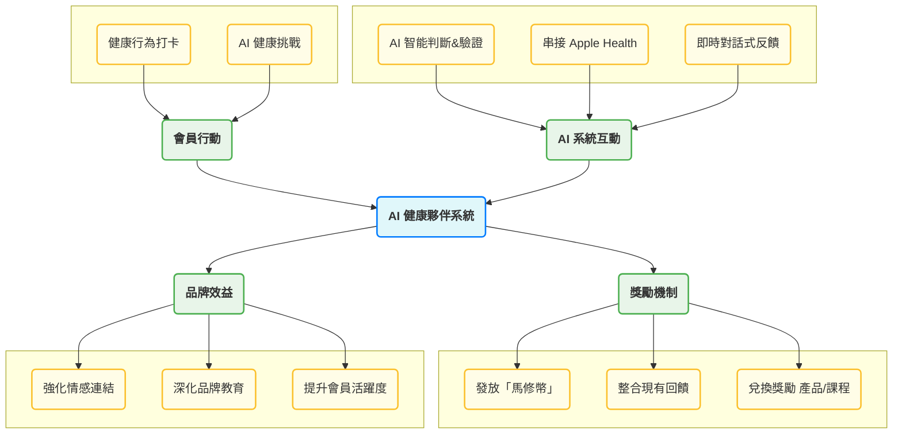

```mermaid
%% --------------------------------------------------
%% -- AI 健康夥伴系統架構圖 (上下延伸版面) --
%% --------------------------------------------------
graph TB
    %% --------------------
    %% -- 1. 定義顏色風格 --
    %% --------------------
    classDef central fill:#e0f7fa,stroke:#007bff,stroke-width:2px,font-weight:bold
    classDef module fill:#e8f5e9,stroke:#4caf50,stroke-width:2px,font-weight:bold
    classDef feature fill:#fffde7,stroke:#fbc02d,stroke-width:2px

    %% --------------------
    %% -- 2. 定義節點 (方塊) --
    %% --------------------

    %% 核心 (藍色)
    SYS(AI 健康夥伴系統):::central

    %% 模組 (綠色)
    MOD1(會員行動):::module
    MOD2(AI 系統互動):::module
    MOD3(獎勵機制):::module
    MOD4(品牌效益):::module

    %% 功能點 (黃色) - 向上延伸
    subgraph " "
        direction LR
        F1_1(健康行為打卡):::feature
        F1_2(AI 健康挑戰):::feature
    end

    subgraph " "
        direction LR
        F2_1(AI 智能判斷&驗證):::feature
        F2_2(串接 Apple Health):::feature
        F2_3(即時對話式反饋):::feature
    end
    
    %% 功能點 (黃色) - 向下延伸
    subgraph " "
        direction LR
        F3_1(發放「馬修幣」):::feature
        F3_2(整合現有回饋):::feature
        F3_3(兌換獎勵 產品/課程):::feature
    end

    subgraph " "
        direction LR
        F4_1(強化情感連結):::feature
        F4_2(深化品牌教育):::feature
        F4_3(提升會員活躍度):::feature
    end
    
    %% --------------------
    %% -- 3. 定義連結 (箭頭) --
    %% --------------------

    %% 頂部：黃色 (功能點) --> 綠色 (模組)
    F1_1 & F1_2 --> MOD1
    F2_1 & F2_2 & F2_3 --> MOD2

    %% 中間：綠色 (模組) --> 藍色 (核心)
    MOD1 --> SYS
    MOD2 --> SYS

    %% 中間：藍色 (核心) --> 綠色 (模組)
    SYS --> MOD3
    SYS --> MOD4

    %% 底部：綠色 (模組) --> 黃色 (功能點)
    MOD3 --> F3_1 & F3_2 & F3_3
    MOD4 --> F4_1 & F4_2 & F4_3
```
