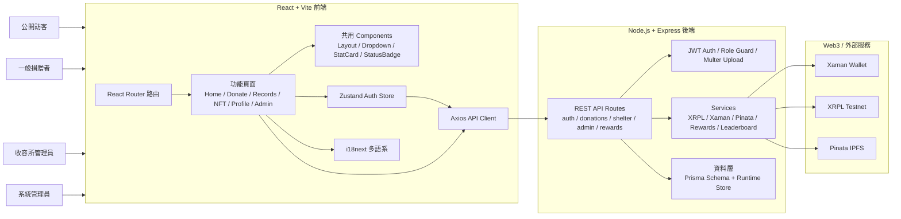

# ALL-IN-Stray-Animals

## PawPawChain 浪浪飼料捐贈平台

PawPawChain 是一個結合 Web3 技術的流浪動物飼料捐贈平台。系統提供線上捐贈、收容所收貨回報、捐贈狀態追蹤、IPFS 收據、XRPL Testnet 上鏈紀錄、PAWPAW Token 回饋與感謝 NFT 展示，讓每一份飼料都有紀錄，讓每一份愛心都被看見。

## 技術架構
## 平台功能介紹

### 角色與使用情境

| 角色 | 可使用功能 | 對應頁面 / API |
| --- | --- | --- |
| 一般捐贈者 | 註冊登入、Xaman 錢包登入、綁定 XRPL 錢包、建立 TrustLine、選擇飼料與收容所、查詢捐贈紀錄、查看 NFT 與 Token 回饋 | `/auth`、`/donate`、`/records`、`/nfts`、`/profile` |
| 收容所管理員 | 查看指派給收容所的捐贈、更新配送 / 收貨狀態、上傳收據照片與備註 | `/shelter`、`/api/shelter/*` |
| 系統管理員 | 查看平台統計、管理飼料品項、收容所、會員、捐贈與獎勵資料 | `/admin`、`/api/admin/*` |
| 公開訪客 | 查看首頁成果、透明公開紀錄、公益排行榜 | `/`、`/transparency`、`/leaderboard` |

### 核心流程

1. 捐贈者登入或註冊帳號，也可使用 Xaman 發起錢包登入。
2. 捐贈者在捐贈頁選擇飼料品項、數量與指定收容所；未指定時由平台媒合。
3. 後端建立捐贈單、付款資料與公益紀錄，並在 Demo Mode 下提供可離線展示的模擬資料。
4. 收容所管理員更新收貨狀態、上傳收據照片與備註。
5. 系統將公益紀錄整理為透明公開資料，並可產生 IPFS 收據、XRPL Hash、PAWPAW Token 與感謝 NFT 獎勵。
6. 捐贈者可在紀錄、個人頁與 NFT 圖鑑查看回饋成果；公開訪客可在透明紀錄與排行榜追蹤平台成效。

### 平台架構圖



### 前後端資料流

```text
Browser UI
  ↓ React Router Pages + Components
Zustand / localStorage session
  ↓ Axios interceptor 加上 Bearer Token
Express /api Routes
  ↓ requireAuth / requireRole / upload middleware
Store + Services
  ├─ Demo runtime-state.json 或 Prisma schema 資料模型
  ├─ XRPL / Xaman：TrustLine、PAWPAW Token、NFT claim、交易 Hash
  └─ Pinata：公益收據與 NFT metadata 上傳 IPFS
```

## 專案介紹

### 技術架構

```text
client/   React + Vite + Tailwind CSS + React Router + Axios + Zustand + Recharts
client/   React + Vite + Tailwind CSS + React Router + Axios + Zustand + Recharts + i18next
server/   Node.js + Express + JWT + Multer + Prisma schema + XRPL/Xaman/Pinata service
```

## 環境設定若不會，可以參考hackmd教學
https://hackmd.io/@IM-Xiang/B1Ujxj21fx/edit
### 前端 Component 設計

| 類型 | 檔案 | 說明 |
| --- | --- | --- |
| App Shell | `client/src/App.jsx`、`client/src/components/Layout.jsx` | 設定前端路由、受保護路由、頁面捲動歸零、桌機 / 手機導覽列、語言切換與登入狀態顯示。 |
| 資料展示 | `client/src/components/StatCard.jsx`、`client/src/components/StatusBadge.jsx`、`client/src/components/PageHero.jsx` | 統一卡片、狀態標籤與頁首視覺，讓首頁、後台、紀錄頁保持一致的 Material 風格。 |
| 表單與篩選 | `client/src/components/FilterDropdown.jsx`、`client/src/components/ShelterDropdown.jsx` | 使用 React state/ref/effect 實作可關閉的下拉選單，用於狀態篩選與收容所選擇。 |
| 頁面模組 | `client/src/pages/*.jsx` | 依功能切分首頁、登入、捐贈、紀錄、NFT 圖鑑、透明紀錄、排行榜、個人頁、收容所後台與管理員後台。 |

### Hooks 與狀態管理

| Hook / 狀態 | 使用位置 | 用途 |
| --- | --- | --- |
| `useAuthStore` | `client/src/store/authStore.js`、多數頁面與 `ProtectedRoute` | 以 Zustand 管理 `user`、`token`、`loading`、`error`，並同步 localStorage；提供 login、register、xamanLogin、bindWallet、logout 等動作。 |
| `useEffect` | `App.jsx`、Dropdown、資料頁面 | 路由切換時回到頁面頂端、監聽點擊外部關閉選單、頁面載入時呼叫 API。 |
| `useState` | 表單、篩選器、後台頁面 | 管理表單輸入、篩選條件、載入狀態與互動 UI。 |
| `useRef` | `FilterDropdown.jsx`、`ShelterDropdown.jsx`、`Layout.jsx` | 保存 DOM 節點以判斷外部點擊或控制導覽互動。 |
| `useTranslation` | `Layout.jsx`、`StatusBadge.jsx`、各頁面 | 透過 react-i18next 讀取多語系字串，支援繁中、英文、日文、德文。 |
| `useLocation` / `useNavigate` | `App.jsx`、`Layout.jsx`、登入與流程頁 | 取得目前路徑、導頁與完成操作後跳轉。 |

### 後端模組與 API

| 模組 | 檔案 | 職責 |
| --- | --- | --- |
| Express 入口 | `server/src/index.js` | 設定 Helmet、CORS、JSON parser、靜態 uploads、健康檢查、API route 與錯誤處理。 |
| 認證與權限 | `server/src/routes/auth.routes.js`、`server/src/middleware/auth.js` | Email/密碼註冊登入、JWT 驗證、角色守衛、Xaman 登入請求與驗證、錢包綁定。 |
| 捐贈與公開紀錄 | `server/src/routes/donations.routes.js`、`server/src/routes/public.routes.js` | 建立捐贈、查詢個人紀錄、提供首頁統計與透明紀錄。 |
| 收容所與管理員後台 | `server/src/routes/shelter.routes.js`、`server/src/routes/admin.routes.js` | 收容所更新配送 / 收貨狀態與照片；管理員維護品項、收容所與平台總覽。 |
| Web3 / 獎勵服務 | `server/src/services/*.js` | 整合 XRPL、Xaman、Pinata、PAWPAW Token、NFT badge 與排行榜計算。 |
| 資料層 | `server/src/data/store.js`、`server/prisma/schema.prisma` | 提供 Demo runtime state、種子資料、狀態標籤與 Prisma 資料模型。 |

### 主要套件運用

| 套件 | 用途 |
| --- | --- |
| React 19、React DOM | 建立 SPA 使用者介面。 |
| Vite | 前端開發伺服器與 production build。 |
| React Router DOM | 宣告式路由、巢狀 Layout、權限導頁。 |
| Tailwind CSS、PostCSS、Autoprefixer | Utility-first 樣式、響應式排版與瀏覽器前綴。 |
| Zustand | 輕量全域登入狀態與 session actions。 |
| Axios | 封裝 API base URL、JWT Authorization interceptor 與檔案 URL 處理。 |
| i18next、react-i18next | 多語系翻譯與語言切換。 |
| lucide-react、framer-motion、recharts、qrcode.react | 圖示、動效、圖表與 QR Code 呈現。 |
| Express、Helmet、CORS | REST API、基本安全標頭與跨來源設定。 |
| jsonwebtoken、bcryptjs | JWT session 與密碼雜湊。 |
| Multer | 收容所收據照片上傳。 |
| Prisma / @prisma/client | 定義資料模型與資料庫 migration。 |
| xrpl、axios、nanoid | XRPL Testnet 操作、外部 API 呼叫與 ID 生成。 |

## 環境設定若不會，可以參考 hackmd 教學

https://hackmd.io/@IM-Xiang/B1Ujxj21fx/edit

## 快速啟動

```bash
npm install
cp .env.example server/.env
npm run dev
```

Windows PowerShell 若遇到 `npm.ps1` 權限問題，可改用：

```powershell
npm.cmd install
npm.cmd run dev
```

- 前端：http://localhost:5173
- 後端健康檢查：http://localhost:4000/api/health

## Demo 帳號

| 角色 | Email | 密碼 |
| --- | --- | --- |
| 一般使用者 | user@pawpaw.test | password123 |
| 收容所管理員 | shelter@pawpaw.test | password123 |
